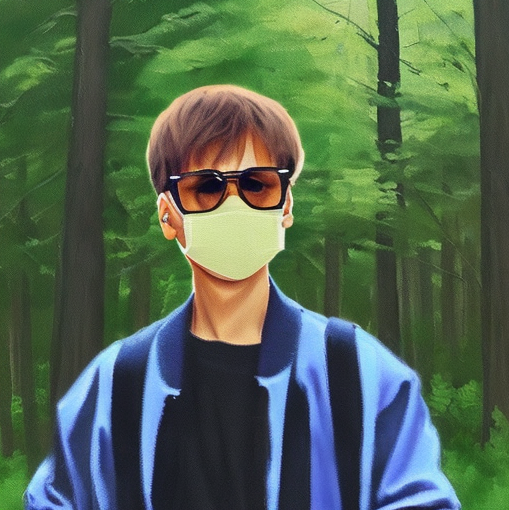

# Fine-tuning Stable Diffusion and Prompt-to-Prompt Editing Techniques

In this project, I use a fine-tuning technique that lets me train text-to-image diffusion models on a concept like a character or style, called [Dreambooth](https://dreambooth.github.io/). Dreambooth allows the model to generate contextualized images of the subject in different scenes, poses, and views. You can find the implementation of Dreambooth [here](https://github.com/ShivamShrirao/diffusers/tree/main/examples/dreambooth).

Dreambooth is a method to personalize text-to-image models given just a few (4-6) images of a subject. However a Stable Diffusion community has found that using 10 to 12 images leads to better results. Consequently, I fine-tuned a model called ['runwayml/stable-diffusion-v1-5'](https://huggingface.co/runwayml/stable-diffusion-v1-5) with two sets of images, each containing 12 images, featuring two of my friends identified as 'bnh' and 'tuki.' The respective priors for preservation classes were denoted as 'Keanu Reeves' and 'Justin Bieber' (human class). 

<table align="center">
    <tr>
        <td align="center"> bnh keanu reeves... </td>
        <td align="center"> </td>
        <td align="center"> </td>
        <td align="center"> </td>
        <td align="center"> </td>
    </tr> 
    <tr>
        <td align="center"> tuki justin bieber... </td>
        <td align="center"> </td>
        <td align="center"> </td>
        <td align="center"> </td>
        <td align="center"> </td>
    </tr> 
</table>
  
Subsequently, I apply various [Prompt-to-Prompt](https://arxiv.org/abs/2208.01626) text-based editing operations. Prompt-to-prompt provides users with simple and intuitive means to edit images, leveraging textual semantic power while preserving the original composition and structure.

<table align="center">
    <tr>
        <td align="center"> </td>
        <td align="center"> photo of ... wearing a pair of sunglasses on a beach</td>
        <td align="center"> van gogh painting of ... wearing a pair of sunglasses on a beach</td>
    </tr>
    <tr>
        <td align="center"> ...bnh keanu reeves... </td>
        <td align="center"> </td>
        <td align="center"> </td>
    </tr> 
    <tr>
        <td align="center"> </td>
        <td align="center"> photo of ... wearing a pair of sunglasses and taking a selfie in front of a mirror</td>
        <td align="center"> van gogh painting of ... wearing a pair of sunglasses and taking a selfie in front of a mirror</td>
    </tr>
    <tr>
        <td align="center"> tuki justin bieber... </td>
        <td align="center"> </td>
        <td align="center"> </td>
    </tr> 
</table>

## Text-Only Localized Editing
Localized editing involves modifying the user-provided prompt, enabling us to preserve the spatial layout, geometry, and semantics.

<table align="center">
  <tr>
      <td align="center"> </td>
      <td align="center"> burger</td>
      <td align="center" colspan="2"> cake</td>
  </tr>
  <tr>
      <td align="center"> A painting of a bnh keanu reeves eating a... </td>
      <td align="center"> </td>
      <td align="center"> </td>
      <td align="center"> </td>
  </tr> 
  <tr>
      <td align="center"> </td>
      <td align="center"> burger</td>
      <td align="center" colspan="2"> lasagne</td>
  </tr>
  <tr>
      <td align="center"> A painting of a tuki justin bieber eating a... </td>
      <td align="center"> </td>
      <td align="center"> </td>
      <td align="center"> </td>
  </tr> 
  <tr>
      <td align="center"> </td>
      <td align="center"> Original</td>
      <td align="center"> W.o prompt-to-prompt</td>
      <td align="center"> prompt-to-prompt</td>
  </tr>
</table>

## Global Editing
Global editing affects all parts of the image, but still retain the original composition.

<table align="center">
  <tr>
      <td align="center"> (Original)drawing of ... on a snowy mountain </td>
      <td align="center"> van gogh painting of ... on a snowy mountain</td>
      <td align="center"> van gogh painting of ... in the jungle</td>
      <td align="center"> van gogh painting of ... in a river</td>
      <td align="center"> van gogh painting of ... in the desert</td>
  </tr>
  <tr>
      <td align="center"> </td>
      <td align="center"> </td>
      <td align="center"> </td>
      <td align="center"> </td>
      <td align="center"> </td>
  </tr>
  <tr>
      <td align="center" colspan="5"> ...a bnh keanu reeves... </td>
  </tr>
</table>

<table align="center">
  <tr>
      <td align="center"> (Original)photo of ...</td>
      <td align="center"> charocal painting of ...</td>
      <td align="center"> impressionism painting of ...</td>
      <td align="center"> neo classical painting of ...</td>
      <td align="center"> watercolor painting of ...</td>
  </tr>
  <tr>
      <td align="center"> </td>
      <td align="center"> </td>
      <td align="center"> </td>
      <td align="center"> </td>
      <td align="center"> </td>
  </tr>
  <tr>
      <td align="center" colspan="5"> ...a tuki justin bieber wearing a sunglasses in a forest</td>
  </tr>
</table>

 ## Attention Re-weighting
By re-scaling the attention of the specified word, we can control the extent to which it influences the generated image.

<table align="center">
  <tr>
      <td align="center"> </td>
      <td align="center"> </td>
      <td align="center"> </td>
      <td align="center"> </td>
      <td align="center"> </td>
  </tr>
  <tr>
      <td align="center" colspan="5"> bnh keanu reeves wearing a pair of sunglasses under a blossom(↓) tree</td>
  </tr>
</table>

 <table align="center">
  <tr>
      <td align="center"> </td>
      <td align="center"> </td>
      <td align="center"> </td>
      <td align="center"> </td>
      <td align="center"> </td>
  </tr>
  <tr>
      <td align="center" colspan="5"> tuki justin bieber wearing a pair of sunglasses under a blossom(↑) tree</td>
  </tr>
</table>
